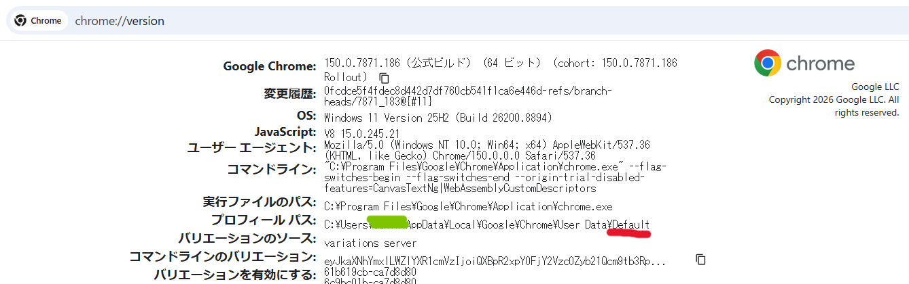
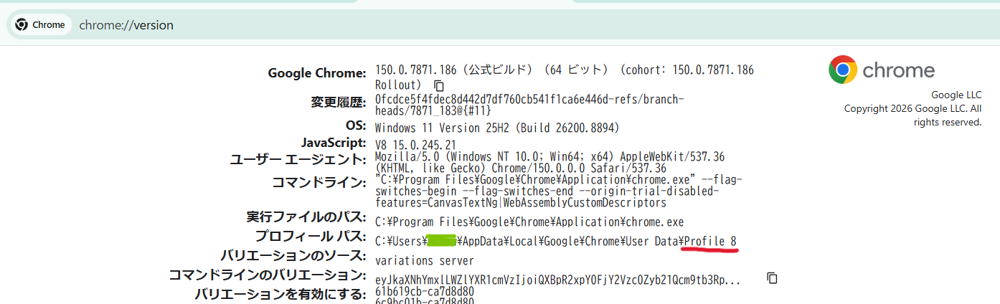

# CWL
CWL (Chrome Workspace Launcher)

CWL は、Chrome の複数プロファイルを自動で起動し、モニタ上に配置するための AutoHotkey v2 製ランチャーです。業務開始時に各プロファイルを起動または再利用し、業務終了時には管理対象のウィンドウをまとめて閉じます。

## 事前準備
- AutoHotkey v2.0 がインストールされていること
- Google Chrome がインストールされていること
- 使用したい Chrome プロファイルの「プロフィール パス（Profile Path）」を確認しておくこと

## config.ini の注意
`Name` と `Folder` は環境に合わせて修正してください。

- `Name` は表示用の名前です。ログや GUI で参照されます。
- `Folder` は Chrome の実際のプロファイルディレクトリ名です。`--profile-directory` にそのまま渡されます。
- ここで指定する値は、Chrome の表示名ではなく、実際のプロフィール パスに含まれるディレクトリ名を使うのが重要です。

### Default プロファイルについて
Default プロファイルで Chrome を起動し、アドレスバーに `chrome://version/` を入力して実行します。


プロフィール パス（Profile Path）: `C:\Users\XXX\AppData\Local\Google\Chrome\User Data\Default`

```ini
[Account1]
Name=Default_Profile_Name
Folder=Default
```

### その他プロファイルについて
対象のプロファイルで Chrome を起動し、アドレスバーに `chrome://version/` を入力して実行します。


プロフィール パス（Profile Path）: `C:\Users\XXX\AppData\Local\Google\Chrome\User Data\Profile 8`

この例では、プロフィール パスの末尾にある `Profile 8` をそのまま `Folder` に指定します。

```ini
[Account2]
Name=Profile_Name01
Folder=Profile 8
```

## 主要設定項目
`config.ini` では、以下の項目を主に設定します。

```ini
[General]
URL=https://example.com/
DisplayMode=Auto
ChromePath=
LogEnabled=1
LogFile=CWL.log
WindowWaitMs=10000
LaunchIntervalMs=800

[Accounts]
Count=3
```

- `URL`: 起動時に開く業務用 URL
- `DisplayMode`: `Auto` / `External` / `Notebook`
  - `Auto`: 外付けモニタがあれば優先、なければノート PC を使用
  - `External`: 常に外付けモニタを優先
  - `Notebook`: 常にノート PC を使用
- `ChromePath`: Chrome 実行ファイルの絶対パス。空欄の場合は自動検出します。
- `WindowWaitMs`: 新しい Chrome ウィンドウが出現するまでの待ち時間
- `LaunchIntervalMs`: アカウントごとの起動間隔
- `Count`: `[Account1]` 〜 `[AccountN]` の数と合わせる

`X` / `Y` / `W` / `H` は 0.0 〜 1.0 の比率で、対象モニタ上の配置位置とサイズを指定します。

## 使い方
1. `CWL.ahk` を実行します。
2. 表示された GUI で「業務開始」を押すと、各アカウントの Chrome プロファイルを起動または再利用し、指定位置に配置します。
3. 「業務終了」を押すと、管理対象のウィンドウをまとめて閉じます。確認ダイアログが表示されます。

## トラブルシューティング
- Chrome が見つからない: `ChromePath` を明示的に指定してください。
- 新しいウィンドウが出現しない: `WindowWaitMs` を大きめに設定してください。
- 誤ったプロファイルが開く: `Folder` に指定した値が、Chrome の実際のプロフィール パス名と一致しているか確認してください。
- 配置位置が意図どおりでない: `X` / `Y` / `W` / `H` の比率を調整してください。
- 複数モニタ環境で配置先が変わる: `DisplayMode` と `ExternalMinWidth` を見直してください。

